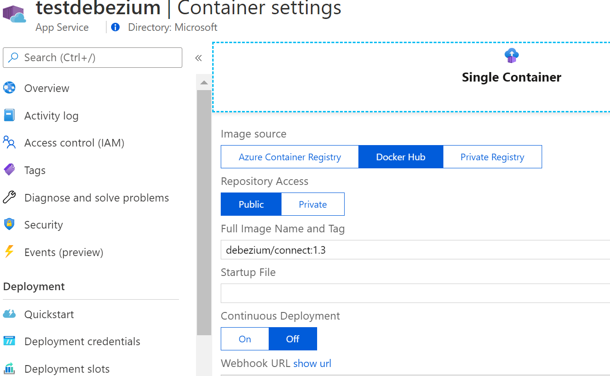

# Streaming CDC changes to Azure Event Hubs using Debezium/KafkaConnect on Azure AppService

Table of contents
=================

<!--ts-->
   * [Create SQL DB and enable CDC](#create-sql-db-and-enable-cdc)
   * [Create Azure EventHubs](#create-azure-eventhubs)
   * [Install Strimzi Kafka Operator](#install-strimzi-operator)
   * [Prepare KafkaConnect Image with Debezium Plugin](#prepare-kafka-connect-image-with-debezium-plugin)
   * [Install KafkaConnect](#install-kafka-connect)
   * [Install Debezium SQL Connector](#install-debezium-sql-connector)
   * [Test](#test)
 <!--te-->


## Create SQL DB and enable CDC

To Create Azure SQL MI and enable CDC, follow steps in our [OpenShift tutorial SQL MI](../strimzi-kafka-connect-eventhubs/README.md#create-sql-db-and-enable-cdc)

## Create Azure EventHubs

To Create Azure SQL MI and enable CDC, follow steps in our [OpenShift tutorial EvntHubs](../strimzi-kafka-connect-eventhubs/README.md#create-azure-eventhubs)
Make sure to use Standard or Premium SKU to get Kafka endpoints enabled.

## Local Test using DockerCompose

Debezim has posted set of Docker images containing KafkaConnect with Debezium connectors pre-installed on [DockerHub](https://hub.docker.com/r/debezium/connect/tags) and examples on how to use these images using Docker-Compose [https://github.com/debezium/debezium-examples/tree/master/unwrap-smt](https://github.com/debezium/debezium-examples/tree/master/unwrap-smt)

- Prior to uploading our configuration to AppService we will test it locally using following configuration `debezium-compose.yaml`:

```yaml
version: '3.3'
services:
  connect:
    image: debezium/connect:1.3
    ports:
     - 8083:8083
    environment:
     - BOOTSTRAP_SERVERS=kafkastore.servicebus.windows.net:9093
     - GROUP_ID=1
     - CONFIG_STORAGE_TOPIC=connect-appsvc-configs
     - OFFSET_STORAGE_TOPIC=connect-appsvc-offsets
     - STATUS_STORAGE_TOPIC=connect-appsvc-status
     - CONFIG_STORAGE_REPLICATION_FACTOR=1
     - OFFSET_STORAGE_REPLICATION_FACTOR=1
     - STATUS_STORAGE_REPLICATION_FACTOR=1
     - CONNECT_REQUEST_TIMEOUT_MS=60000
     - CONNECT_SECURITY_PROTOCOL=SASL_SSL
     - CONNECT_SASL_MECHANISM=PLAIN
     - CONNECT_SASL_JAAS_CONFIG=org.apache.kafka.common.security.plain.PlainLoginModule required username="$$ConnectionString" password="Endpoint=sb://kafkastore.servicebus.windows.net/;SharedAccessKeyName=RootManageSharedAccessKey;SharedAccessKey=XXXXX";
     - CONNECT_PRODUCER_SECURITY_PROTOCOL=SASL_SSL
     - CONNECT_PRODUCER_SASL_MECHANISM=PLAIN
     - CONNECT_PRODUCER_SASL_JAAS_CONFIG=org.apache.kafka.common.security.plain.PlainLoginModule required username="$$ConnectionString" password="Endpoint=sb://kafkastore.servicebus.windows.net/;SharedAccessKeyName=RootManageSharedAccessKey;SharedAccessKey=XXXX";
     - CONNECT_CONSUMER_SECURITY_PROTOCOL=SASL_SSL
     - CONNECT_CONSUMER_SASL_MECHANISM=PLAIN
     - CONNECT_CONSUMER_SASL_JAAS_CONFIG=org.apache.kafka.common.security.plain.PlainLoginModule required username="$$ConnectionString" password="Endpoint=sb://kafkastore.servicebus.windows.net/;SharedAccessKeyName=RootManageSharedAccessKey;SharedAccessKey=XXXX";
```
Replace fields
- `BOOTSTRAP_SERVERS` with your Azure EventHubs namespace
- `CONNECT_PRODUCER_SASL_JAAS_CONFIG` and all the `JAAS_CONFIG` connection strings with your Azure EventHubs Keys

**Note:** Take note of double **$$** in `username=$$ConnectionString`, as thats how we need to escape the dollar sign in docker Compose, otherwise you will get Authentication errors on startup.

Lots of useful settings for Debezium Docker Image described here [https://github.com/babylonhealth/debezium/tree/master/connect/0.9] (https://github.com/babylonhealth/debezium/tree/master/connect/0.9)

- Run Docker Compose

```sh
docker-compose -f debezium-compose.yaml up
```

- Verify Kafka Connect is up and plugins are loaded

```sh
curl  http://localhost:8083/connector-plugins | jq .
```
```json
[
{
"class": "io.debezium.connector.db2.Db2Connector",
"type": "source",
"version": "1.3.0.Final"
},
{
"class": "io.debezium.connector.mongodb.MongoDbConnector",
"type": "source",
"version": "1.3.0.Final"
},
{
"class": "io.debezium.connector.mysql.MySqlConnector",
"type": "source",
"version": "1.3.0.Final"
},
{
"class": "io.debezium.connector.oracle.OracleConnector",
"type": "source",
"version": "1.3.0.Final"
},
{
"class": "io.debezium.connector.postgresql.PostgresConnector",
"type": "source",
"version": "1.3.0.Final"
},
{
"class": "io.debezium.connector.sqlserver.SqlServerConnector",
"type": "source",
"version": "1.3.0.Final"
},
{
"class": "org.apache.kafka.connect.file.FileStreamSinkConnector",
"type": "sink",
"version": "2.6.0"
},
{
"class": "org.apache.kafka.connect.file.FileStreamSourceConnector",
"type": "source",
"version": "2.6.0"
},
{
"class": "org.apache.kafka.connect.mirror.MirrorCheckpointConnector",
"type": "source",
"version": "1"
},
{
"class": "org.apache.kafka.connect.mirror.MirrorHeartbeatConnector",
"type": "source",
"version": "1"
},
{
"class": "org.apache.kafka.connect.mirror.MirrorSourceConnector",
"type": "source",
"version": "1"
}
]
```

### Register SQL Connector for Azure MI instance

Debezium Connectors are typically registered using REST API, here is definition `sql-connector.json` to monitor Azure SQL MI instance:

``` json
{
    "name": "azure-sql-connector",
    "config": {
        "connector.class" : "io.debezium.connector.sqlserver.SqlServerConnector",

        "database.hostname": "cdctestsmi.public.144a376e88cf.database.windows.net",
        "database.port": "3342",
        "database.dbname": "cdcKafka",
        "database.server.name": "cdctestsmi",
        "database.user": "XXXX",
        "database.password": "XXXX",
        "table.include.list": "dbo.Customers",
        "include.schema.changes": "true", 
        "database.history": "io.debezium.relational.history.MemoryDatabaseHistory",
        "tasks.max" : "1",                
        "database.history.kafka.bootstrap.servers" : "kafkastore.servicebus.windows.net:9093",
        "database.history.kafka.topic": "cdc-updates"      
     }
}
```
Replace `database.hostname`, `database.dbname`,`database.server.name`,`database.user` and `database.password` with your Database connection details. `database.history.kafka.bootstrap.servers` with your Kafka namespace.

We are using `"database.history": "io.debezium.relational.history.MemoryDatabaseHistory"` as Azure EventsHubs does not support CDCConfig API at this point as shown in [https://github.com/Azure/azure-event-hubs-for-kafka/issues/53](https://github.com/Azure/azure-event-hubs-for-kafka/issues/53)


 - Register Connector

 ```sh
curl -X POST -H "Content-Type: application/json" --data @sql-connector.json http://localhost:8083/connectors 
```

- Verify Connector Status

```json
curl -s http://localhost:8083/connectors/azure-sql-connector/status

{
  "name": "azure-sql-connector",
  "connector": {
    "state": "RUNNING",
    "worker_id": "172.19.0.2:8083"
  },
  "tasks": [
    {
      "id": 0,
      "state": "RUNNING",
      "worker_id": "172.19.0.2:8083"
    }
  ],
  "type": "source"
}
```

### Monitor Changes with kafkacat

Monitor updates with `kafkacat` as described in [OpenShift tutorial - Kafkacat test](../strimzi-kafka-connect-eventhubs/README.md#test)


## Create App Service 

Azure App Service supports option to host custom container or multiple containers and manage their lifecycles. Refer to Azure docs on how to set it up [Configure App Service to deploy containers](https://docs.microsoft.com/en-us/azure/app-service/tutorial-custom-container?pivots=container-linux#configure-app-service-to-deploy-the-image-from-the-registry)
Or with Portal UI


- As our container is listening on the custom port we need to set that in App Service settings `WEBSITES_PORT`
and as Debezium Startup takes a bit of the time we increased startup timeout `WEBSITES_CONTAINER_START_TIME_LIMIT`


## AppService with MultiContainer

App Serice supports Docker Compose files to host multiple containers, in this scenario we use compose definition mostly to setup the correct environment variables and reuse of the almost same compose file that was used locally.

```yaml
version: '3.3'
services:
  connect:
    image: debezium/connect:1.3
    ports:
     - 8083:8083
    environment:
     - BOOTSTRAP_SERVERS=kafkacdc.servicebus.windows.net:9093
     - GROUP_ID=1
     - CONFIG_STORAGE_TOPIC=conn-appsvc-configs
     - OFFSET_STORAGE_TOPIC=conn-appsvc-offsets
     - STATUS_STORAGE_TOPIC=conn-appsvc-status
     - CONFIG_STORAGE_REPLICATION_FACTOR=1
     - OFFSET_STORAGE_REPLICATION_FACTOR=1
     - STATUS_STORAGE_REPLICATION_FACTOR=1

     - CONNECT_REQUEST_TIMEOUT_MS=60000
     - CONNECT_SECURITY_PROTOCOL=SASL_SSL
     - CONNECT_SASL_MECHANISM=PLAIN
     - CONNECT_SASL_JAAS_CONFIG=org.apache.kafka.common.security.plain.PlainLoginModule required username="$ConnectionString" password="Endpoint=sb://kafkacdc.servicebus.windows.net/;SharedAccessKeyName=RootManageSharedAccessKey;SharedAccessKey=XXXX";
     - CONNECT_PRODUCER_SECURITY_PROTOCOL=SASL_SSL
     - CONNECT_PRODUCER_SASL_MECHANISM=PLAIN
     - CONNECT_PRODUCER_SASL_JAAS_CONFIG=org.apache.kafka.common.security.plain.PlainLoginModule required username="$ConnectionString" password="Endpoint=sb://kafkacdc.servicebus.windows.net/;SharedAccessKeyName=RootManageSharedAccessKey;SharedAccessKey=XXXX";
     - CONNECT_CONSUMER_SECURITY_PROTOCOL=SASL_SSL
     - CONNECT_CONSUMER_SASL_MECHANISM=PLAIN
     - CONNECT_CONSUMER_SASL_JAAS_CONFIG=org.apache.kafka.common.security.plain.PlainLoginModule required username="$ConnectionString" password="Endpoint=sb://kafkacdc.servicebus.windows.net/;SharedAccessKeyName=RootManageSharedAccessKey;SharedAccessKey=XXXXX";
     - HOST_NAME=0.0.0.0
     - ADVERTISED_HOST_NAME=testdebezium.azurewebsites.net
```
Replace the Kafka settings with your Keys and namespace name. And take note that there is no need for double `$$` in `username="$ConnectionString"` which is different from local test.

**NOTE:** As Debezium KafkaConnect is hosted by AppService with DNS name (similar to ingress controller or reverse proxy), we need to set `HOST_NAME` and `ADVERTISED_HOST_NAME` for Debezium REST API server to properly bind to the network interface and accept  our WebApp DNS name.
- `ADVERTISED_HOST_NAME` - should be the dns name of the App Service. 


Apply docker Compose either by using `az` command of portal


- Wait for Debezium to start and verify the Connectors

```sh
curl https://testdebezium.azurewebsites.net/connectors
```

- Register SQL connector with the `sql-connector.json` as described above [](#) 

```sh
curl -X POST -H "Content-Type: application/json" --data @sql-connector.json https://testdebezium.azurewebsites.net/connectors
```

and test with `kafkacat`

## AppService with Single Docker Container

While Docker Compose version provides quick and easy test, for Production sceanrios its recommended to use single container 


And provide all variables as Application settings


Test it the same way as decsribed above.
