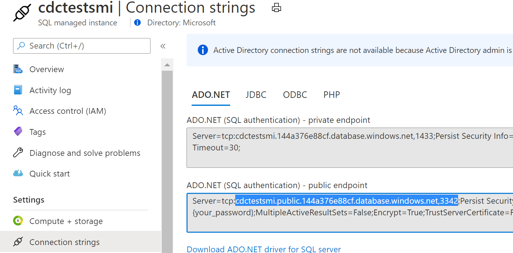
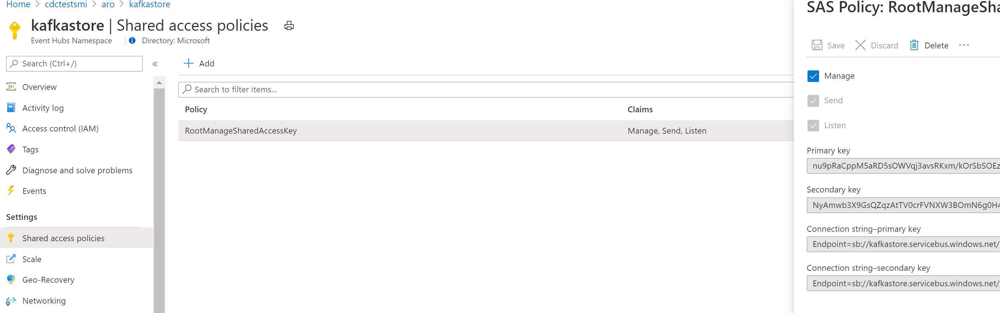
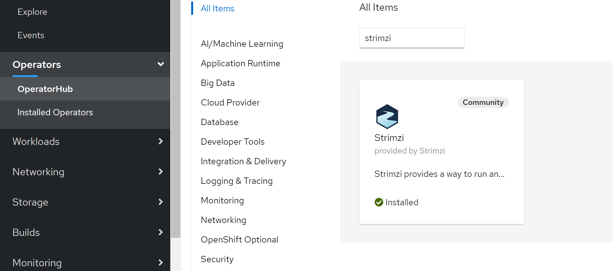

# Streaming CDC changes to Azure Event Hubs using Strimzi and Debezium

# Create SQL DB and enable CDC
This test used Azure SQL MI instance and as per docs on Debezium (Azure SQL is not yet supported)

- Create Azure SQL MI instance with Public endpoint, make sure port 3342 is enabled on NSG rules for access, get connection string for public endpoint


- Enable CDC Capture as per docs: [CDC with ADF ](https://docs.microsoft.com/en-us/azure/data-factory/tutorial-incremental-copy-change-tracking-feature-portal)

```
create table Persons
(
    PersonID int NOT NULL,
    Name varchar(255),
    Age int
    PRIMARY KEY (PersonID)
);

INSERT INTO Persons (PersonID,Name, Age) VALUES (1, 'Erichsen', 35);
INSERT INTO Persons (PersonID,Name, Age) VALUES (2, 'Kane', 25);

EXEC sys.sp_cdc_enable_db 

EXEC sys.sp_cdc_enable_table
@source_schema = 'dbo',
@source_name = 'Persons', 
@role_name = 'null',
@supports_net_changes = 1
```

## Create Azure EventHubs

We will use Azure EventHubs as Kafka broker and integrate it with Kafka Connect to stream data.

Create Azure EventHubs and take note of access keys



## Install Strimzi Operator
KafkaConnect with its connectors could be used as a middleman that would stream CDC events to Azure EventHubs Broker.
To install Kafka connect we will use popular Strimzi operator but will only use CRDs to setup KafkaConnect and KafkaConnect SQL Connector.

- Option 1. Install from OperatorsHub  


- Option2. Install operator using Helm or YAML manifests
Described in  [Kafka Connect the eay way](https://itnext.io/kafka-connect-on-kubernetes-the-easy-way-b5b617b7d5e9)
```
//add helm chart repo for Strimzi
helm repo add strimzi https://strimzi.io/charts/
//install it! (I have used strimzi-kafka as the release name)
helm install strimzi-kafka strimzi/strimzi-kafka-operator
```
or [Running Debezium on OpenShift](https://debezium.io/documentation/reference/operations/openshift.html)

``` 
export STRIMZI_VERSION=0.19.0
git clone -b $STRIMZI_VERSION https://github.com/strimzi/strimzi-kafka-operator
cd strimzi-kafka-operator

# Switch to an admin user to create security objects as part of installation:
oc login -u system:admin
oc create -f install/cluster-operator && oc create -f examples/templates/cluster-operator
```

# Prepare Kafka Connect Image with Debezium Plugin

KafkaConnect Loads Connectors from its internal `plugin.path`. Debezium is the most popular connector for CDC capture from various Databases.

The default KafkaConnect image does not include Debezium connector so we need extend the image. `Dockerfile` in this repo demonstrates the technique, using as base image versions that installed Operator supports:

```
FROM strimzi/kafka:0.19.0-kafka-2.5.0
USER root:root
RUN mkdir -p /opt/kafka/plugins/debezium

# DOWNLOAD and copy connector
RUN curl https://repo1.maven.org/maven2/io/debezium/debezium-connector-sqlserver/1.3.0.Final/debezium-connector-sqlserver-1.3.0.Final-plugin.tar.gz | tar xvz
RUN mv ./debezium-connector-sqlserver/* /opt/kafka/plugins/debezium/ 
    
USER 1001
```

Buid and push the image (sample is using my repo on dockerhub)
```
docker build -t lenisha/kafka-connect-debezium:2.5.0-1.3.0 .
docker push lenisha/kafka-connect-debezium:2.5.0-1.3.0
```

## Install Kafka Connect

**Note:** all examples use kubernetes namespace `cdc-kafka`

Now we need to setup KafkaConnect worker to be able to talk to Azure EventHubs as a broker.
- Create a secret to hold AzureEventHubs auth details, replace in this yaml file `eventhubspassword` with your EventHubs Keys and apply:
`oc apply -f eventhubs-secret.yaml`

- Create Credentials for Connector to authenticate to Azure SQL MI, replace in `sqlserver-credentials.properties` fields for `database.password` and user and create a secret:

```
oc -n cdc-kafka create secret generic sql-credentials --from-file=sqlserver-credentials.properties
```

- Create KafkaConnect worker Cluster, using the image that was created in the step above


```
apiVersion: kafka.strimzi.io/v1beta1
kind: KafkaConnect
metadata:
  name: kafka-connect-cluster-debezium
  annotations:
    strimzi.io/use-connector-resources: "true"
spec:
  replicas: 1
  bootstrapServers: kafkastore.servicebus.windows.net:9093
  image: lenisha/kafka-connect-debezium:2.5.0-1.3.0
  version: 2.5.0
  config:
    group.id: connect-cluster
    offset.storage.topic: strimzi-connect-cluster-offsets
    config.storage.topic: strimzi-connect-cluster-configs
    status.storage.topic: strimzi-connect-cluster-status
    config.storage.replication.factor: 1
    offset.storage.replication.factor: 1
    status.storage.replication.factor: 1
    config.providers: file
    config.providers.file.class: org.apache.kafka.common.config.provider.FileConfigProvider
  authentication:
    type: plain
    username: $ConnectionString
    passwordSecret:
      secretName: eventhubssecret
      password: eventhubspassword
  tls:
    trustedCertificates: []
  logging:
    type: inline
    loggers:
      rootLogger.level: DEBUG
  resources:
    requests:
      cpu: "1"
      memory: 2Gi
    limits:
      cpu: "2"
      memory: 2Gi    
  jvmOptions: 
    "-Xmx": "1g"
    "-Xms": "1g"
  readinessProbe: 
    initialDelaySeconds: 15
    timeoutSeconds: 5
  livenessProbe:
    initialDelaySeconds: 15
    timeoutSeconds: 5  

  externalConfiguration:
    volumes:
      - name: connector-config
        secret:
          secretName: sql-credentials  
```

update:
- `bootstrapServers` to point to your AzureEventHubs namespace
- `image` with your connector image

- Apply the manifest
```
oc apply -f kafka-connect.yaml -n cdc-kafka
```

- Verify that KafkaConnect Cluster is running

```
$ oc get pods -n cdc-kafka
NAME                                                     READY   STATUS    RESTARTS   AGE
kafka-connect-cluster-debezium-connect-bdd84fd96-vj2p9   1/1     Running   0          33m
strimzi-cluster-operator-v0.19.0-7d4f9f5cbf-cxxlx        1/1     Running   0          14h

eneros@MININT-KRE3N7E MINGW64 /c/projects/RBC/aks-tests/oshift/strimzi-kafka-connect-eventhubs (master)
$ oc get svc -n cdc-kafka
NAME                                         TYPE        CLUSTER-IP       EXTERNAL-IP   PORT(S)    AGE
kafka-connect-cluster-debezium-connect-api   ClusterIP   172.30.109.146   <none>        8083/TCP   33m
```

Connect to the KafkaConnect Server and verify that SQl Connector plugin is loaded and available:
```
oc exec -i -n cdc-kafka kafka-connect-cluster-debezium-connect-6668b7d974-wcgnf -- curl -X GET http://kafka-connect-cluster-debezium-connect-api:808
3/connector-plugins | jq .

[
  {
    "class": "io.debezium.connector.sqlserver.SqlServerConnector",
    "type": "source",
    "version": "1.3.0.Final"
  },
  {
    "class": "org.apache.kafka.connect.file.FileStreamSinkConnector",
    "type": "sink",
    "version": "2.5.0"
  },
  {
    "class": "org.apache.kafka.connect.file.FileStreamSourceConnector",
    "type": "source",
    "version": "2.5.0"
  },
  {
    "class": "org.apache.kafka.connect.mirror.MirrorCheckpointConnector",
    "type": "source",
    "version": "1"
  },
  {
    "class": "org.apache.kafka.connect.mirror.MirrorHeartbeatConnector",
    "type": "source",
    "version": "1"
  },
  {
    "class": "org.apache.kafka.connect.mirror.MirrorSourceConnector",
    "type": "source",
    "version": "1"
  }
]

```

## Install SQL Connector

Now we will configure and  install SQLConnector instance. It's typically done using REST api but Strimzi Operator automated it using K8S CRD objects.

Make sure `labels` is pointing to the KafkaConnect cluster we created in the step above

```
apiVersion: kafka.strimzi.io/v1alpha1
kind: KafkaConnector
metadata:
  name: azure-sql-connector
  labels:
    strimzi.io/cluster: kafka-connect-cluster-debezium
spec:
  class: io.debezium.connector.sqlserver.SqlServerConnector
  tasksMax: 1
  config:
    database.hostname: "cdctestsmi.public.144a376e88cf.database.windows.net" 
    database.port: "3342"
    database.dbname: "cdcKafka"
    database.server.name: "cdctestsmi"
    database.user: ${file:/opt/kafka/external-configuration/connector-config/sqlserver-credentials.properties:database.user}
    database.password: ${file:/opt/kafka/external-configuration/connector-config/sqlserver-credentials.properties:database.password}
    table.include.list: "dbo.Persons"
    database.history.kafka.topic: "cdc-updates"
    include.schema.changes: "true" 
    database.history: "io.debezium.relational.history.MemoryDatabaseHistory"
    errors.log.enable: "true"
```

- replace `database.hostname`, `database.dbname` and `database.server.name` with details of your SQL Server

and install the connector
```
oc delete -f sqlserver-connector.yaml -n cdc-kafka
```
# Test
